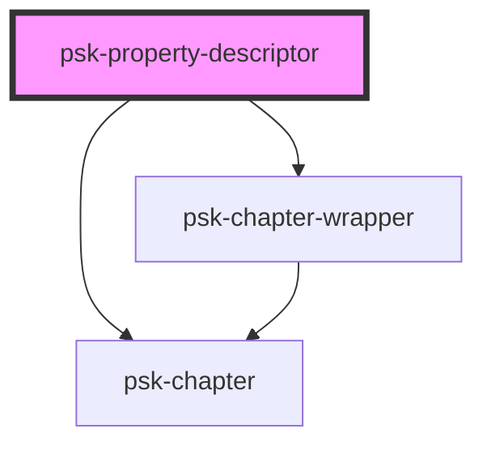

# psk-property-descriptor

<!-- Auto Generated Below -->

## Properties

| Property | Attribute | Description | Type     | Default |
| -------- | --------- | ----------- | -------- | ------- |
| `title`  | `title`   |             | `string` | `''`    |

## Dependencies

### Depends on

- [psk-chapter-wrapper](../psk-chapter)
- [psk-chapter](../psk-chapter)

### Graph

----------------------------------------------

*Made by [WebCardinal](https://github.com/webcardinal) contributors.*
