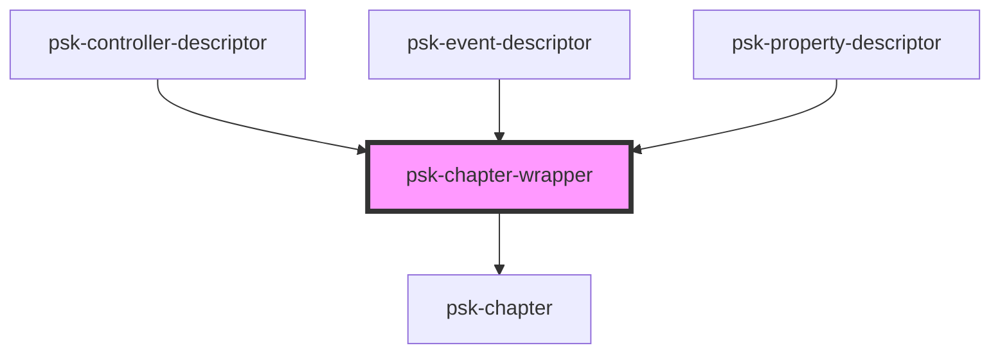

# psk-chapter-wrapper

<!-- Auto Generated Below -->

## Properties

| Property | Attribute | Description | Type     | Default     |
| -------- | --------- | ----------- | -------- | ----------- |
| `title`  | `title`   |             | `string` | `undefined` |

## Dependencies

### Used by

 - [psk-controller-descriptor](../pages-components)
 - [psk-event-descriptor](../pages-components)
 - [psk-property-descriptor](../pages-components)

### Depends on

- [psk-chapter](.)

### Graph

----------------------------------------------

*Made by [WebCardinal](https://github.com/webcardinal) contributors.*
