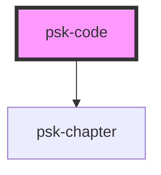

# psk-code

<!-- Auto Generated Below -->

## Properties

| Property   | Attribute  | Description | Type     | Default |
| ---------- | ---------- | ----------- | -------- | ------- |
| `file`     | `file`     |             | `string` | `""`    |
| `language` | `language` |             | `string` | `'xml'` |
| `title`    | `title`    |             | `string` | `""`    |

## Dependencies

### Depends on

- [psk-chapter](../psk-chapter)

### Graph

----------------------------------------------

*Made by [WebCardinal](https://github.com/webcardinal) contributors.*
