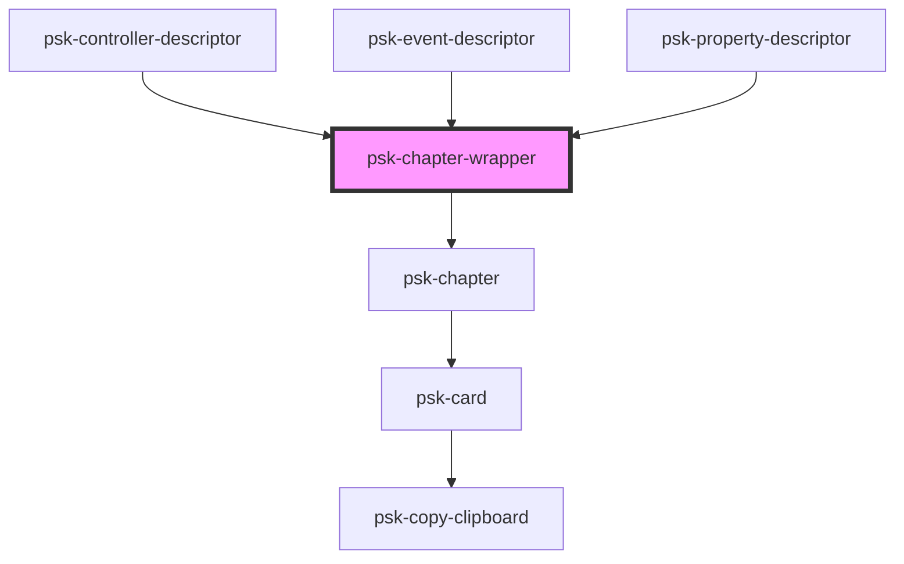

# psk-chapter-wrapper

<!-- Auto Generated Below -->

## Properties

| Property | Attribute | Description | Type     | Default     |
| -------- | --------- | ----------- | -------- | ----------- |
| `title`  | `title`   |             | `string` | `undefined` |

## Dependencies

### Used by

 - psk-controller-descriptor
 - psk-event-descriptor
 - psk-property-descriptor

### Depends on

- [psk-chapter](.)

### Graph

----------------------------------------------

*Built with [StencilJS](https://stenciljs.com/)*
